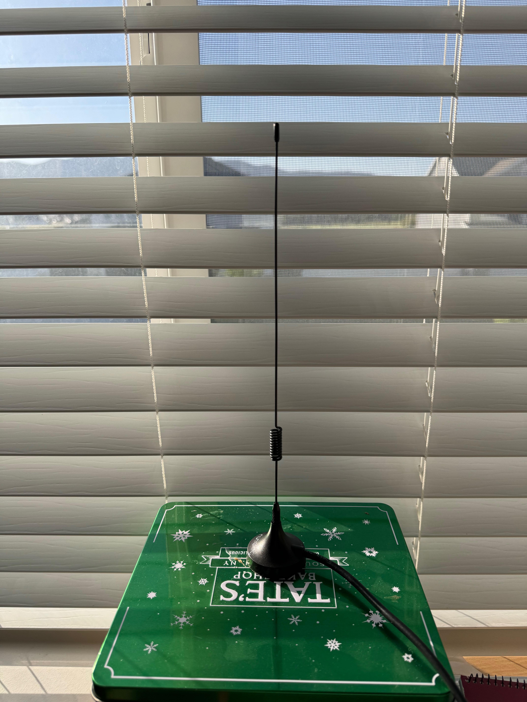

<h1 align="center">Aircraft Tracker (Skydar) 🛩️</h1>

Live air traffic map app utilizing community and self reported aircraft tracking data

 

<kbd>
  
</kbd>

---
## Table Of Contents

- [Running Locally](#running-locally)
- [Database Commands](#database-commands)
- [Technologies Utilized](#technologies-utilized)
- [Features](#features)

---
## Running Locally

1. Clone repo
2. Change working directory into the cloned project directory
3. Install node packages `npm install`

4. Install PostgreSQL, if not already installed on machine

   - [Download PostreSQL](https://www.postgresql.org/download/)

5. Make a .env file using the .env.example file as a template `cp .env.example .env`

   - populate the .env with the correct values including your PostgreSQL username and password.
   - You can run the app for a while whithout having an `OPENSKY_USERNAME` and `OPENSKY_PASSWORD` since they allow up to 400 requests calls. If you want to run longer (4000 requests) you can create a free OpenSky Network account.
   - You can run without a `VITE_OPENAIP_CLIENT_ID`, but you won't be able to turn on the aeronautical chart map overlay. You can optain a free account at openaip.net to get a client ID if you want to enable this feature.

6. Create database by running: `npm run db:create`

   - If you want to seed the database run: `npm run db:seed`
     - Note: Seed data has old enough lastContact timestamps that the database cleanup cron job will remove the seed data when it runs.

7. Run the app `npm run dev`
   - After running `npm run dev` you can find the URL to enter into your web browser's address bar.
    <kbd>
      
    </kbd>

---
## Database Commands

| Command             | Description                                |
| ------------------- | ------------------------------------------ |
| `npm run db:create` | Create database                            |
| `npm run db:seed`   | Seed the database                          |
| `npm run db:sync`   | Sync the DB                                |
| `npm run db:drop`   | Drop the DB (includes confirmation prompt) |

---
## Technologies Utilized

- React
- Vite + Express
- PostgreSQL with Sequelize
- ADS-B Receiver  
    <kbd>
      
    </kbd>
  - Feeding data to external data sources
    - FlightAware
    - Flightradar24
    - OpenSky Network
  - Raspberry Pi for the computer
  - SDR digital radio receiver
  - Bandpass filter for ADS-B specific frequencies
  - Antenna  
    <kbd>
      
    </kbd>
- Leaflet and React-Leaflet for the map
- Node-Cron — for scheduled tasks
  - External API calls
  - Web scraper
  - Database cleanup
- React-Dom — to create custom aircraft markers for map
- Axios — for both internal and external API calls
- [Socket.io](http://Socket.io)
  - Immediate data updates from server to multiple clients
- Puppeteer web scraper
  - To get flight details from free public sources without using expensive commercial APIs.
- Tailwind CSS
  - including customized classes and theme colors
- Chalk — for colorizing my structured log outputs.
  - Enables easier and quicker visual parsing of logs.

---
## Features

- Predictive positioning and altitude for aircraft on map  
  <kbd>
    
  </kbd>
  - Implemented trigonometry to calculate next position coordinates on map using the most recently received data coordinates, velocity, and true tracking direction along with the data's capture timestamp.
  - Reduces frequency of data updates from server, since client can predict aircraft positions since last data update.
  - Creates appealing smooth movement of aircraft on map.
  - Predictively calculates altitude based on most recent data's altitude, vertical speed, and data's capture timestamp.  
- Altitude indicating colors
  - See which planes are airborne vs on the ground.
- Vertical rate indicating arrows, including indication of magnitude.
- Flight watch list
  - Airline logo
  - Flight status
  - Departure and arrival airports
- Weather radar overlay
- Multiple selectable map image layers
- Aeronautical chart elements
  - Airspaces
  - Airports and heliports
- Aircraft popup details
  - Aircraft images
  - ADS-B transmitter ICAO24 identifier
  - Callsign / registration
  - Altitude
  - Vertical speed
  - Ground speed
  - True tracking direction
- Callsign next to aircraft marker
- Ordering aircraft icons on top of others based on altitude

---
:star: Star me on GitHub — it does motivate me
